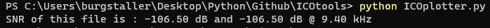
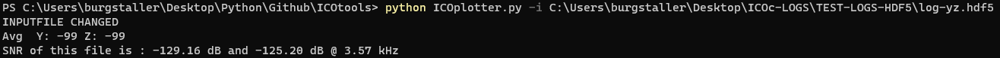

# ICOtools

Contains the ICOtronic tools that can be used on the ICOtronic log files for later analyses of the recorded signals from the ICOc scripts.

## Version

This Readme is written for ICOtools v.1.1.0

## Tools

### IcoPlotter

- Measures a SNR value of the recording
- Opens a plotter with the recorded signal
- Plots the Power Spectral Density Graph for the recorded signal

### IcoAnalyzer

- Measures packetloss of the recorded signal
- Measures how many datapoints are outside of a given maximum and minimum

## Setup Instructions

To use the ICOtools you need to have Python installed.

To setup the scripts you just need to clone the repository of [ICOtools](https://github.com/MyTooliT/ICOtools).

To install the required libraries please use the following command in the root directory of the repository:

```sh
pip install -r requirements.txt
```

## Using the tools

Open the command line in the folder of the scripts. Now you just have to run the script you want with "python SCRIPT-NAME" and maybe some parameter if you don't want to use the standard parameters.

### Using IcoPlotter

The IcoPlotter script looks for a log.hdf5 file in the folder the scripts are as a default. After using the command: "python IcoPlotter.py" the script will run and after loading the file open the graph of the recording


The calculated SNR will be written in the command line.



With closing the plotter the script will finish and the command line will be ready for a new command. For running the script with another input-file use the following parameter:

#### IcoPlotter parameter

##### -h

This argument calls the help menu of the script instead of running the script.

##### -i

With "-i datapath" you can change the to be plotted file.

The datapath is the path to the ICOc-logfile you want to plot and can be given as a relative path or an absolute path.

Example:



### Using IcoAnalyzer

The IcoAnalyzer script looks for the log.hdf5 file in the folder the script is run at as a default. After using the command: `python IcoAnalyzer.py` the script will run and look at log.hdf5 file in the folder. It will list the paketloss and values outside of the given range. All values outside the defined values (default is -1g and 1g) are deemed as outside and will be counted. After finishing looking through the file the script will print the results in the command line.


If you want to change the file the script looks through or the minimum and maximum values you have to give the script some extra parameter. Using multiple parameters on one command is also possible.

#### IcoAnalyzer parameter

##### -h

This argument calls the help menu of the script instead of running the script.

##### -i

With "-i FILEPATH" you can change the file the script sees through. This path can be given as a relative or an absolute path.


##### -d

With "-d" you can activate a more detailed information about the packetloss. Not only will it show the percentage of the file, it will now also show how many packets were lost with each packetloss.


##### -m

With "-m VALUE" you can change the minimal value for datapoints to be checked. All values below this parameter will be counted as out of the borders.

##### -v

With "-v VALUE" you can change the maximum value for datapoints to be checked. All values above this parameter will be counted as out of the borders.


