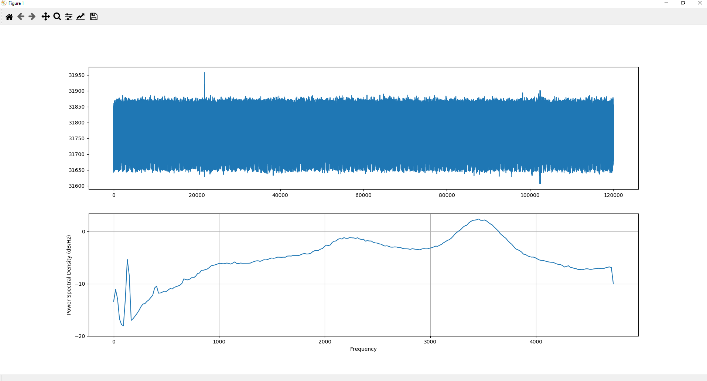
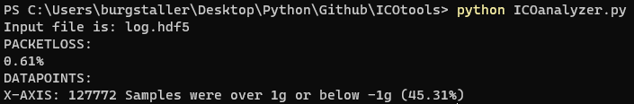
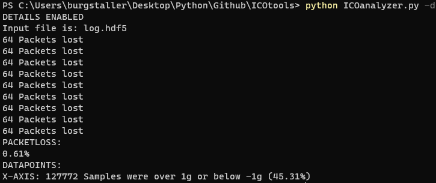
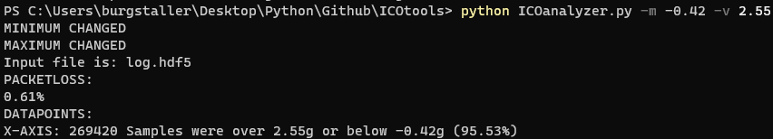
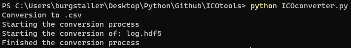

# ICOtools

Contains the ICOtronic tools that can be used on the ICOtronic log files for later analyses of the recorded signals from the ICOc scripts.

## Version

This Readme is written for ICOtools v.1.2.0

## Tools

### IcoPlotter

- Measures a SNR value of the recording
- Opens a plotter with the recorded signal
- Plots the Power Spectral Density Graph for the recorded signal

### IcoAnalyzer

- Measures packetloss of the recorded signal
- Measures how many datapoints are outside of a given maximum and minimum

### IcoConverter

- Converts the recorded .hdf5 files into .csv or .xlsx files

## Setup Instructions

To use the ICOtools you need to have Python installed.

To setup the scripts you just need to clone the repository of [ICOtools](https://github.com/MyTooliT/ICOtools).

To install the required libraries please use the following command in the root directory of the repository:

```sh
pip install -r requirements.txt
```

## Using the tools

Open the command line in the folder of the scripts. Now you just have to run the script you want with "python SCRIPT-NAME" and maybe some parameter if you don't want to use the standard parameters.

### Using ICOplotter

The ICOplotter script looks for a `log.hdf5` file in the current working directory by default. After using the command:

```sh
python ICOPlotter.py
```

the script will load this file and open the graph of the recording



The calculated SNR will be written to the standard output.

```
SNR of this file is : -106.50 dB and -106.50 dB @ 9.40 kHz
```

With closing the plotter the script will finish and the command line will be ready for a new command. For running the script with another input-file use one of the parameters described below.

#### IcoPlotter Parameter

##### -h

This argument calls the help menu of the script instead of running the script.

##### Filepath

To change the HDF filepath from `log.hdf5` in the current working directory, please specify the filepath as positional argument.

Example:

```sh
python ICOplotter.py HDF5/log-x.hdf5
```

### Using IcoAnalyzer

The IcoAnalyzer script looks for the file `log.hdf5` in the current working directory (usually this will be the root of this repository) by default. After you use the command:

```
python ICOAnalyzer.py
```

the script will run and analyze `log.hdf5`. The script will then list the packet loss and values outside of the given range (default is -1g and 1g).



If you want to change the file the script analyzes or the minimum and maximum values you have to provide some extra parameters. Using multiple parameters is also possible.

#### IcoAnalyzer parameter

##### -h

This argument calls the help menu of the script instead of running the script.

##### -i

With "-i FILEPATH" you can change the file the script sees through. This path can be given as a relative or an absolute path.


##### -d

With "-d" you can activate a more detailed information about the packetloss. Not only will it show the percentage of the file, it will now also show how many packets were lost with each packetloss.



##### -m

With "-m VALUE" you can change the minimal value for datapoints to be checked. All values below this parameter will be counted as out of the borders.

##### -v

With "-v VALUE" you can change the maximum value for datapoints to be checked. All values above this parameter will be counted as out of the borders.



### Using IcoConverter

The IcoConverter script looks for the file `log.hdf5` in the current working directory (usually this will be the root of this repository) by default. After you use the command:

```
python ICOConverter.py
```

the script will run and analyze `log.hdf5`. The script will then convert the .hdf5 file and create `log.csv` and save it into the same directory. Attention: When there is already an file with the name of the converted .csv it will be overwritten.



If you want to change the file the script converts or the format it should convert to you have to provide some extra parameters. Using multiple parameters is also possible.

#### IcoConverter parameter

##### -h

This argument calls the help menu of the script instead of running the script.

##### Filepath

With `inputs` positional parameter you can change the file the script converts.

```
python ICOconverter.py ~/Downloads/log.hdf5
Starting the conversion process
Converting “/Users/rene/Downloads/log.hdf5” to “/Users/rene/Downloads/log.csv”
Finished the conversion process
```

This path can be given as a relative or an absolute path. If the given path is a folder the script will convert ALL .hdf5 files inside the given folder.

```
python ICOconverter.py ~/Downloads/TEST-LOGS-HDF5
Starting the conversion process
Converting “/Users/rene/Downloads/TEST-LOGS-HDF5/log-z.hdf5” to “/Users/rene/Downloads/TEST-LOGS-HDF5/log-z.csv”
Converting “/Users/rene/Downloads/TEST-LOGS-HDF5/log-xy.hdf5” to “/Users/rene/Downloads/TEST-LOGS-HDF5/log-xy.csv”
Converting “/Users/rene/Downloads/TEST-LOGS-HDF5/log-xyz.hdf5” to “/Users/rene/Downloads/TEST-LOGS-HDF5/log-xyz.csv”
Converting “/Users/rene/Downloads/TEST-LOGS-HDF5/log-xz.hdf5” to “/Users/rene/Downloads/TEST-LOGS-HDF5/log-xz.csv”
Converting “/Users/rene/Downloads/TEST-LOGS-HDF5/log-x.hdf5” to “/Users/rene/Downloads/TEST-LOGS-HDF5/log-x.csv”
Converting “/Users/rene/Downloads/TEST-LOGS-HDF5/log-yz.hdf5” to “/Users/rene/Downloads/TEST-LOGS-HDF5/log-yz.csv”
Converting “/Users/rene/Downloads/TEST-LOGS-HDF5/log-y.hdf5” to “/Users/rene/Downloads/TEST-LOGS-HDF5/log-y.csv”
Finished the conversion process
```

##### -e

With "-e" you can change the format the script converts to to excel sheets. Instead of .csv it now creates .xlsx files.

```
python ICOconverter.py ~/Downloads/*.hdf5 -e
Starting the conversion process
Starting the conversion of: /Users/rene/Downloads/log.hdf5
Starting the conversion of: /Users/rene/Downloads/Measurement_2022-03-31_10-20-16.hdf5
Finished the conversion process
```
