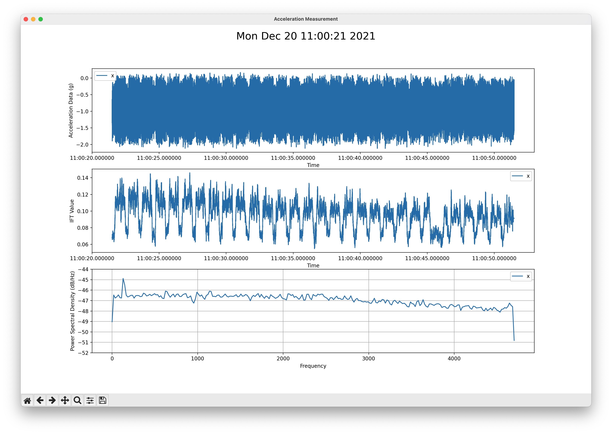

# ICOtools

Auxiliary set of tools to analyze data from the [ICOtronic system](https://github.com/MyTooliT/ICOc):

- [ICOplotter](#readme:section:icoplotter): Visualize data and calculate signal to noise ratio
- [ICOanalyzer](#readme:section:icoanalyzer): Measures packet loss
- [ICOconverter](#readme:section:icoconverter): Convert HDF5 measurement files into other formats

## Requirements

- [Python](https://www.python.org)

## Setup Instructions

### Install

Please execute the following command:

```sh
pip install --upgrade git+https://github.com/mytoolit/ICOtools
```

### Remove

```sh
pip uninstall -y icotools
```

<a name="readme:section:icoplotter"></a>

## ICOplotter

- Measures signal to noise ratio (SNR) value of a measurement
- Opens a plotter window visualizing the recorded signal
- Plots the power spectral density graph for the recorded signal
- Prints the IFT value of the signal

### Usage

The ICOplotter script looks for a `log.hdf5` file in the current working directory by default. After using the command:

```sh
icoplotter
```

the script will load this file and open the graph of the recording



The calculated SNR will be written to the standard output.

```
SNR of this file is : -106.50 dB and -106.50 dB @ 9.40 kHz
```

With closing the plotter the script will finish and the command line will be ready for a new command. For running the script with another input-file use one of the parameters described below.

#### Parameters

##### `-h`

This argument calls the help menu of the script instead of running the script.

##### Filepath

To change the HDF filepath from `log.hdf5` in the current working directory, please specify the filepath as positional argument.

Example:

```sh
icoplotter HDF5/log-x.hdf5
```

<a name="readme:section:icoanalyzer"></a>

## ICOanalyzer

- Measures packet-loss of the recorded signal
- Measures how many datapoints are outside of a given minimum and maximum value

### Usage

The ICOanalyzer script looks for the file `log.hdf5` in the current working directory (usually this will be the root of this repository) by default. After you use the command:

```sh
icoanalyzer
```

the script will run and analyze `log.hdf5`. The script will then list the packet loss and values outside of the given range (default is -1g and 1g).

```
> icoanalyzer
INPUTFILE CHANGED
Input file is: log.hdf5
PACKETLOSS:
0.0%
DATAPOINTS:
X-AXIS: 0 Samples were over 1g or below -1g (0.0%)
Z-AXIS: 8257 Samples were over 1g or below -1g (100.0%)
```

If you want to change the file the script analyzes or the minimum and maximum values you have to provide some extra parameters. Using multiple parameters is also possible.

#### Parameters

##### `-h`, `--help`

This argument calls the help menu of the script instead of running the script.

##### Filepath

With the `input` positional parameter you can change the file the script analyzes:

```
> icoanalyzer logs/log-xz.hdf5
INPUTFILE CHANGED
Input file is: logs/log-xz.hdf5
PACKETLOSS:
24.59%
DATAPOINTS:
X-AXIS: 106992 Samples were over 1g or below -1g (100.0%)
Z-AXIS: 106992 Samples were over 1g or below -1g (100.0%)
```

##### `-d`, `--details`

With "-d" you can activate a more detailed information about the packetloss. Not only will it show the percentage of the file, it will now also show how many packets were lost with each packetloss.

```
> icoanalyzer -d
DETAILS ENABLED
Input file is: log.hdf5
64 Packets lost
64 Packets lost
64 Packets lost
64 Packets lost
64 Packets lost
64 Packets lost
64 Packets lost
64 Packets lost
64 Packets lost
PACKETLOSS:
0.61%
DATAPOINTS:
X-AXIS: 127772 Samples were over 1g or below -1g (45.318)
```

##### `-m`, `--min`

With "-m VALUE" you can change the minimal value for datapoints to be checked. All values below this parameter will be counted as out of the borders.

##### `-v`, `--max`

With "-v VALUE" you can change the maximum value for datapoints to be checked. All values above this parameter will be counted as out of the borders.

```
> icoanalyzer -m -0.42 -v 2.55
MINIMUM CHANGED
MAXIMUM CHANGED
Input file is: log.hdf5
PACKETLOSS:
0.61%
DATAPOINTS:
X-AXIS: 269420 Samples were over 2.55g or below -0.42g (95.53%)
```

<a name="readme:section:icoconverter"></a>

## ICOconverter

- Converts HDF5 measurement files (`.hdf5`) into `.csv` (Comma-Separated Values) or `.xlsx` (Excel) files

### Usage

The ICOconverter script looks for the file `log.hdf5` in the current working directory by default. After you use the command:

```
icoconverter
```

the script will run and analyze `log.hdf5`. The script will then convert the .hdf5 file and create `log.csv` and save it into the same directory. Attention: When there is already an file with the name of the converted .csv it will be overwritten.

```
> icoconverter
Starting the conversion process
Converting “log.hdf5” to “log.csv”
Finished the conversion process
```

If you want to change the file the script converts or the format it should convert to you have to provide some extra parameters. Using multiple parameters is also possible.

#### Parameters

##### `-h`, `--help`

This argument calls the help menu of the script instead of running the script.

##### Filepath

With the `inputs` positional parameter you can change the file the script converts.

```
icoconverter ~/Downloads/log.hdf5
Starting the conversion process
Converting “/Users/rene/Downloads/log.hdf5” to “/Users/rene/Downloads/log.csv”
Finished the conversion process
```

This path can be given as a relative or an absolute path. If the given path is a folder the script will convert ALL .hdf5 files inside the given folder.

```
icoconverter ~/Downloads/TEST-LOGS-HDF5
Starting the conversion process
Converting “/Users/rene/Downloads/TEST-LOGS-HDF5/log-z.hdf5” to “/Users/rene/Downloads/TEST-LOGS-HDF5/log-z.csv”
Converting “/Users/rene/Downloads/TEST-LOGS-HDF5/log-xy.hdf5” to “/Users/rene/Downloads/TEST-LOGS-HDF5/log-xy.csv”
Converting “/Users/rene/Downloads/TEST-LOGS-HDF5/log-xyz.hdf5” to “/Users/rene/Downloads/TEST-LOGS-HDF5/log-xyz.csv”
Converting “/Users/rene/Downloads/TEST-LOGS-HDF5/log-xz.hdf5” to “/Users/rene/Downloads/TEST-LOGS-HDF5/log-xz.csv”
Converting “/Users/rene/Downloads/TEST-LOGS-HDF5/log-x.hdf5” to “/Users/rene/Downloads/TEST-LOGS-HDF5/log-x.csv”
Converting “/Users/rene/Downloads/TEST-LOGS-HDF5/log-yz.hdf5” to “/Users/rene/Downloads/TEST-LOGS-HDF5/log-yz.csv”
Converting “/Users/rene/Downloads/TEST-LOGS-HDF5/log-y.hdf5” to “/Users/rene/Downloads/TEST-LOGS-HDF5/log-y.csv”
Finished the conversion process
```

##### `-e`, `--excel`

With "-e" you can change the format the script converts to to excel sheets. Instead of .csv it now creates .xlsx files.

```
icoconverter ~/Downloads/*.hdf5 -e
Starting the conversion process
Starting the conversion of: /Users/rene/Downloads/log.hdf5
Starting the conversion of: /Users/rene/Downloads/Measurement_2022-03-31_10-20-16.hdf5
Finished the conversion process
```
